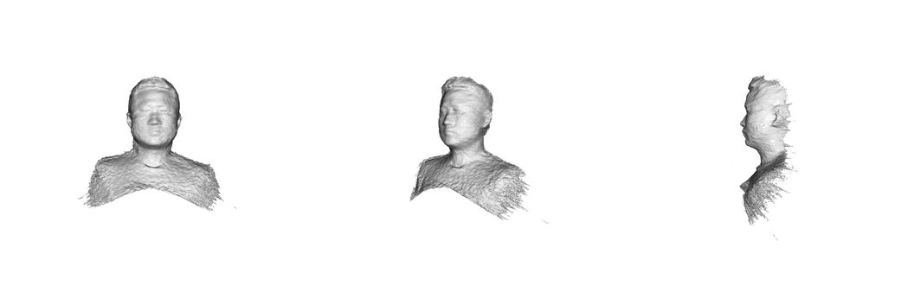
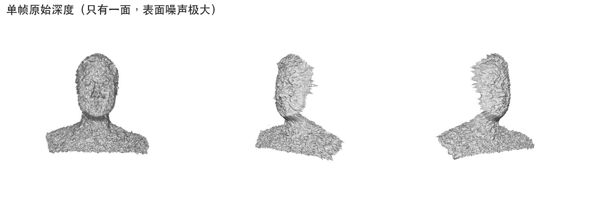

# facescan

facescan 把配备 TrueDepth 前置摄像头的 iPhone（iPhone X 及后续机型）变成一台人脸三维扫描仪。iOS App 负责采集关键帧（深度、相机位姿、相机内参、彩色画面）；Mac 端的 Python 工具用 Open3D 把这些关键帧融合成三角网格。

整条链路设计为可由编码 agent 驱动。agent 可以通过命令行在手机端触发扫描、查询采集状态、拉取数据回 Mac 并执行三维重建，全程无需在 App 界面进行人工点击，各环节均提供稳定的脚本接口。


*真实扫描在正脸、四分之三侧与正侧三个角度的网格渲染效果（整段扫描融合所得）。*

作为对照，单张深度图本身不可用——只有一面，表面噪声极大：


*单帧原始深度（只有一面，表面噪声极大）。多角度融合才能得到上面那样完整平滑的网格。*

## 依赖

- 一台配备 TrueDepth 的 iPhone（iPhone X 及后续机型）与一台 Mac，两者需完成设备配对
- Xcode
- xcodegen
- Xcode Metal 工具链（执行 `xcodebuild -downloadComponent MetalToolchain` 安装）
- Python 侧环境工具：uv

## 安装环境

执行仓库根目录的环境初始化脚本：

```bash
scripts/setup.sh
```

## 安装 App

编译工程：

```bash
scripts/build_ios.sh
```

编译并安装到指定设备：

```bash
scripts/build_ios.sh --install --device "My iPhone"
```

构建过程中，脚本会自动从本地缓存的 provisioning profile 解析开发团队信息，并将私有配置写入 `.local/local.env`（该文件已加入 `.gitignore`）。

## 采集

在 Mac 端通过命令行驱动采集流程：

1. 启动采集会话：
   ```bash
   scripts/scan.sh start --run-id demo01
   ```
2. 查询采集状态：
   ```bash
   scripts/scan.sh status
   ```
3. 结束采集：
   ```bash
   scripts/scan.sh stop
   ```
4. 将采集数据拉取到 Mac：
   ```bash
   scripts/pull.sh --run-id demo01 --out scans/demo01
   ```

### 采集指引

- **把手机固定住，不要手持**：用迷你三脚架或手机支架把手机立在固定的桌面或台面上，镜头对着脸。手持会引入抖动和手部运动，明显降低重建质量。
- **人自己动，手机不动**：面对手机站好，保持头部和上身不动（不要转头），用脚走小碎步带动全身慢慢旋转。这样脸部相对手机平滑转过不同角度，而相机保持静止。
- **来回慢扫，不要一次转到底**：从正脸开始，向左转一点，再向右转一点，然后转回来；整个过程缓慢、小幅、多次往返（例如在正面到左右各约 50° 之间反复摆动）。不要一口气转到侧面极限。匀速来回摆动能让每个角度都有多帧重叠，重建质量明显好于一次转到底。
- **便于操作且覆盖充分**：来回摆动能让脸部各处获得多次覆盖，且手机屏幕始终大致对着人，按屏幕上的开始/停止按钮很方便。
- **表情与遮挡物**：保持中性表情，摘掉眼镜等遮挡物。

## 重建

三维重建在 Mac 本地运行，不在手机端执行：

```bash
scripts/fuse.sh scans/demo01 --out out/demo01.ply
```

重建输出为标准三角网格格式（PLY 或 OBJ），可直接使用 MeshLab、Blender 或其他三维查看器打开。

## 整体结构

- iOS App：负责采集关键帧，包括深度、相机位姿、相机内参及彩色图像。
- Mac 端工具：负责流程调度、数据拉取及基于 Open3D 的三角网格融合重建。
- 架构定义与文件契约参见 `docs/rfc.md`。
- Agent 自动化入口参见 `AGENTS.md`。

## 说明

使用前请注意以下物理特性与当前版本边界：

- 材质空洞：头发、眼镜、瞳孔和高光处会产生空洞，因为这些材质吸收或偏折红外点阵。
- 视野范围：前置摄像头只能看到脸的前方一侧（约 ±90°），转过去的侧后方和后脑扫不到，这是传感器的物理限制。
- 表情建模：v1 版本不建模表情变化，采集时请保持中性表情。
